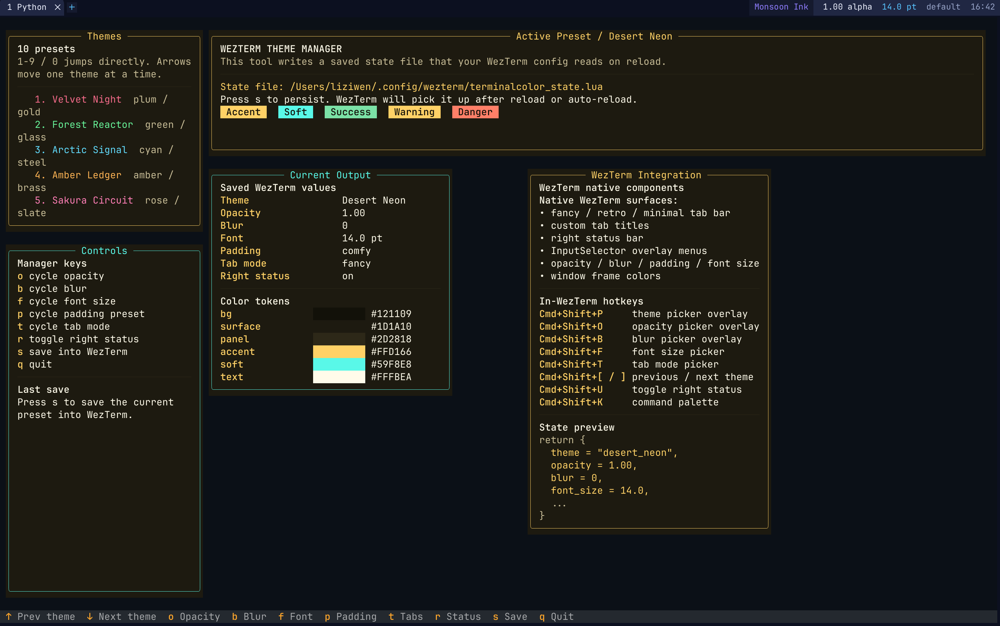
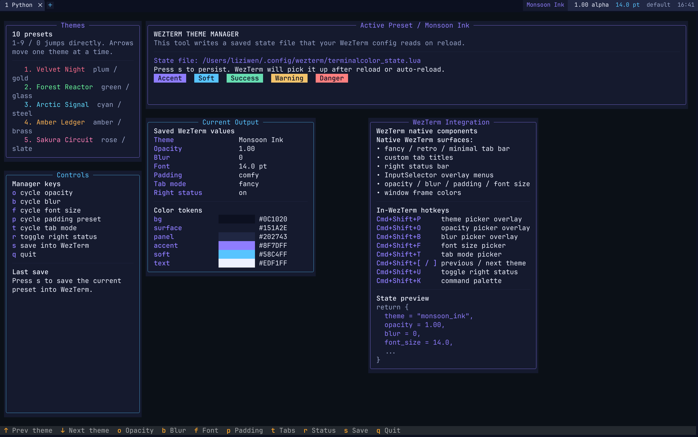

<p align="center">
  
</p>

<h1 align="center">✨ WezTerm Theme Manager</h1>

<p align="center">
  <strong>A cinematic appearance layer for WezTerm.</strong>
</p>

<p align="center">
  Turn your terminal into a <strong>live-tunable visual workspace</strong> with a polished <strong>Textual manager</strong> and a native <strong>WezTerm UI bridge</strong>.
</p>

<p align="center">
  
  
  
  
  
  
</p>

<p align="center">
  <a href="#-preview">Preview</a> •
  <a href="#-why-this-exists">Why</a> •
  <a href="#-features">Features</a> •
  <a href="#-quick-start">Quick Start</a> •
  <a href="#-controls">Controls</a> •
  <a href="#-architecture">Architecture</a> •
  <a href="#-future-ideas">Future Ideas</a>
</p>

---

## 🎬 Preview

<p align="center">
  
  
</p>

<p align="center">
  <em>Replace the images above with your real screenshots or GIFs for the full effect.</em>
</p>

---

## 🪄 What is this?

**WezTerm Theme Manager** is a lightweight but high-impact theming workflow for **WezTerm**.

It combines two parts:

- a local **Textual** control panel for interactive appearance tuning
- a native **WezTerm bridge** that reads saved state and wires runtime UI controls

This means your terminal theme is no longer trapped inside a giant config file.  
Instead, you get a small, clean, state-driven system for making WezTerm feel **personal, dynamic, and premium**.

---

## 💥 Why this exists

WezTerm is powerful, but appearance customization usually ends up looking like this:

- too many scattered config edits
- too many reload cycles
- too much friction for tiny visual changes
- too much logic mixed with too much styling
- too little joy

This project separates:

- **visual state**
- **runtime bridge logic**
- **interactive control surface**

So instead of treating terminal styling like a pile of config fragments, you get something closer to a real product experience.

> **Not just a theme switcher.**  
> A visual control layer for people who actually care how their terminal feels.

---

## 🌈 Features

<div align="center">

| Capability | Description |
|---|---|
| 🎨 Theme Presets | 10 custom themes |
| 🪟 Opacity Control | Cycle window transparency levels |
| 🌫️ Blur Control | Tune macOS blur intensity |
| 🔠 Font Size Presets | Switch sizing profiles quickly |
| 📦 Padding Presets | Change terminal spacing instantly |
| 🧩 Tab Modes | Fancy / Retro / Minimal styles |
| 📡 Right Status | Toggle runtime status bar content |
| 🧭 InputSelector Menus | Native overlay pickers inside WezTerm |
| 🏷 Custom Tab Titles | Better runtime tab presentation |
| ⚡ Command Palette Integration | Native command workflow |
| 💾 Persistent State | Saved settings survive restart/reload |

</div>

---

## 🧠 Core idea

This project introduces a tiny state-driven appearance pipeline:

```text
Textual Manager -> terminalcolor_state.lua -> WezTerm Bridge -> Live UI
```

### Flow

1. Launch the local **Textual manager**
2. Browse themes and tweak appearance settings
3. Save the chosen preset into:

```lua
~/.config/wezterm/terminalcolor_state.lua
```

4. The **WezTerm bridge** reads that state
5. WezTerm applies the saved visual behavior on startup or reload

The result is simple:

* cleaner config
* faster iteration
* better runtime UX
* less visual chaos in `wezterm.lua`

---

## 🛠 What it can control

### 🎨 Theme system

* 10 built-in themes
* previous / next switching
* direct numeric selection
* persistent saved preset state

### 🪟 Window appearance

* opacity presets
* blur presets
* font size presets
* padding presets

### 🧩 Tab bar styling

* **fancy**
* **retro**
* **minimal**

### 🧭 Native WezTerm UI

* `InputSelector` overlays
* right status bar
* custom tab titles
* command palette integration
* runtime theme / layout switching

---

## ⚡ Quick Start

### 1. Enter the project directory

```bash
cd /Users/liziwen/Desktop/terminalcolor
```

### 2. Activate the Python environment

```bash
source .venv/bin/activate
```

### 3. Run the manager

```bash
python app.py
```

---

## 🎮 Controls

## Local manager controls

Inside the Textual manager:

| Key         | Action                             |
| ----------- | ---------------------------------- |
| `1-9` / `0` | Pick one of the 10 themes          |
| `← / →`     | Previous / next theme              |
| `o`         | Cycle opacity                      |
| `b`         | Cycle blur                         |
| `f`         | Cycle font size                    |
| `p`         | Cycle padding                      |
| `t`         | Cycle tab mode                     |
| `r`         | Toggle right status                |
| `s`         | Save current settings into WezTerm |
| `q`         | Quit                               |

### Save behavior

When you press `s`, the manager:

1. writes the active state into:

```bash
~/.config/wezterm/terminalcolor_state.lua
```

2. touches:

```bash
~/.config/wezterm/wezterm.lua
```

so WezTerm can pick up the new saved values more smoothly.

---

## ⌨️ Native WezTerm controls

These hotkeys work directly inside **WezTerm**:

| Hotkey        | Action              |
| ------------- | ------------------- |
| `Cmd+Shift+P` | Theme picker        |
| `Cmd+Shift+O` | Opacity picker      |
| `Cmd+Shift+B` | Blur picker         |
| `Cmd+Shift+F` | Font size picker    |
| `Cmd+Shift+T` | Tab mode picker     |
| `Cmd+Shift+Y` | Padding picker      |
| `Cmd+Shift+[` | Previous theme      |
| `Cmd+Shift+]` | Next theme          |
| `Cmd+Shift+U` | Toggle right status |
| `Cmd+Shift+K` | Command palette     |

This gives you two layers of control:

* a richer external manager for big changes
* native in-terminal controls for quick adjustments

---

## 🏗 Architecture

```text
terminalcolor/
├── app.py
└── wezterm_theme_lab.lua
```

### File map

| File                                        | Role                                    |
| ------------------------------------------- | --------------------------------------- |
| `app.py`                                    | Local Textual manager                   |
| `wezterm_theme_lab.lua`                     | WezTerm bridge + runtime UI integration |
| `~/.config/wezterm/terminalcolor_state.lua` | Persisted live state                    |
| `~/.config/wezterm/wezterm.lua`             | Main WezTerm config entry               |

---

## 🔌 WezTerm integration

Your `~/.config/wezterm/wezterm.lua` should load the bridge:

```lua
dofile("/Users/liziwen/Desktop/terminalcolor/wezterm_theme_lab.lua")
```

This bridge is responsible for:

* reading saved appearance state
* applying theme settings
* wiring native selector menus
* updating tab titles
* updating the right status bar
* switching tab presentation modes

---

## 📂 State file

The live saved state is stored here:

```lua
~/.config/wezterm/terminalcolor_state.lua
```

That file acts as the shared source of truth between the manager and WezTerm.

This makes the system:

* persistent
* inspectable
* easy to extend
* easy to debug

---

## 🖼 Design philosophy

This project is built around one simple belief:

> **Terminal UX should not feel like editing a giant pile of visual constants.**

A terminal can be:

* expressive
* polished
* personal
* responsive
* fun to tune

So the goal here is not just “switch themes.”
The goal is to create a compact but beautiful **appearance system** for WezTerm.

---

## 🌟 Example workflow

A typical workflow looks like this:

1. Open the Textual manager
2. Preview a few themes
3. Adjust opacity, blur, padding, and font size
4. Save the combination you like
5. Jump back into WezTerm
6. Use native pickers for smaller changes later

That gives you:

* a **full control panel** outside the terminal
* a **native control surface** inside the terminal

---

## 📁 Project structure

```text
/Users/liziwen/Desktop/terminalcolor
├── app.py
├── wezterm_theme_lab.lua
├── README.md
└── assets/
    ├── banner.png
    ├── preview-manager.png
    └── preview-wezterm.png
```

---

## ⚠️ Important

Your current WezTerm config now loads:

```lua
/Users/liziwen/Desktop/terminalcolor/wezterm_theme_lab.lua
```

If you move this project directory, you **must update that path** inside:

```bash
~/.config/wezterm/wezterm.lua
```

Otherwise WezTerm will no longer load the bridge.

---

## 🖥 Platform notes

This setup is primarily designed for **macOS + WezTerm**.

Some appearance behavior, especially blur-related features, may be platform-specific.

---

## 🧪 Recommended screenshot / assets setup

To make this README really hit on GitHub, create:

* `assets/banner.png`
* `assets/preview-manager.png`
* `assets/preview-wezterm.png`

And ideally also:

* `assets/demo.gif`

Then add this near the top:

```markdown
<p align="center">
  
</p>
```

A good GIF of theme switching will make the repo page look dramatically better.

---

## 🚀 Future ideas

There is a lot of room to make this even more ridiculous:

* wallpaper-aware theming
* theme import / export
* per-workspace presets
* automatic day / night switching
* live palette editor
* font family presets
* richer status widgets
* preview thumbnails
* cloud sync
* animated transitions

---

## ❤️ About

**WezTerm Theme Manager** is a lightweight appearance control layer for WezTerm, combining a local Textual dashboard with native terminal-side controls to deliver a cleaner, faster, and much more beautiful terminal workflow.

---

<p align="center">
  <strong>⚡ Make your terminal look like it has taste.</strong>
</p>

<p align="center">
  If this project makes your setup cooler, cleaner, or simply more fun to use, give it a star.
</p>

